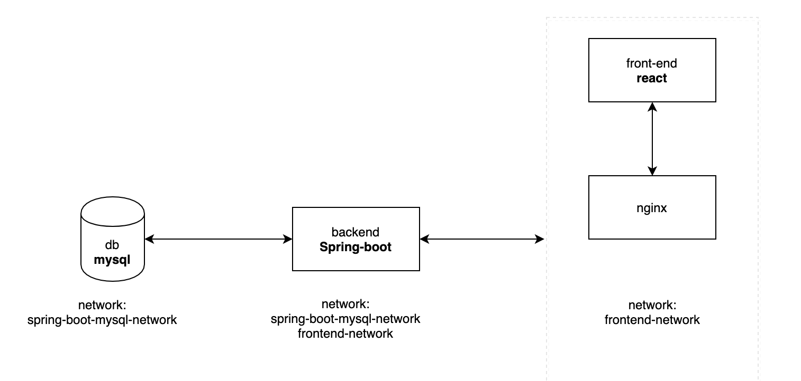
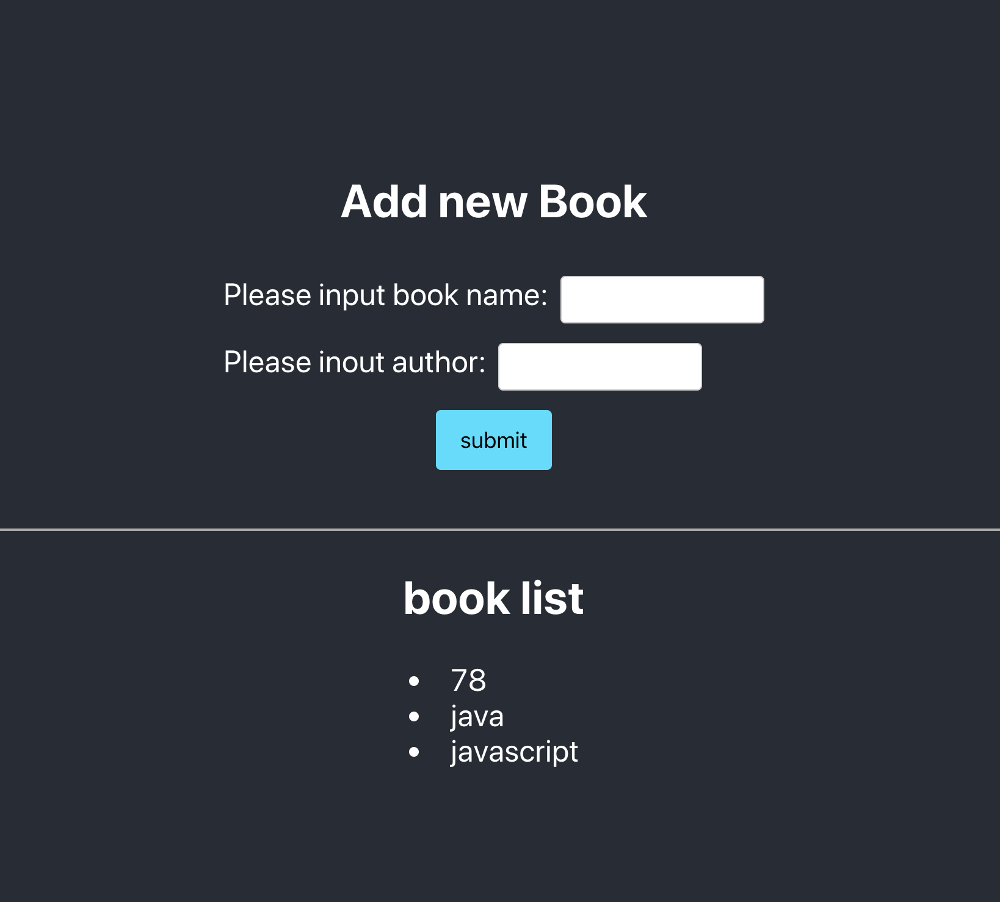

## Introduce
this project just build a full stack demos with mysql, springboot and react to practise the docker and docker-compose.
## Set up
```$xslt
cd backend/
./gradlew build
docker-compose up
```
visit `http://localhost:80`

## Architecture diagram


## UI

